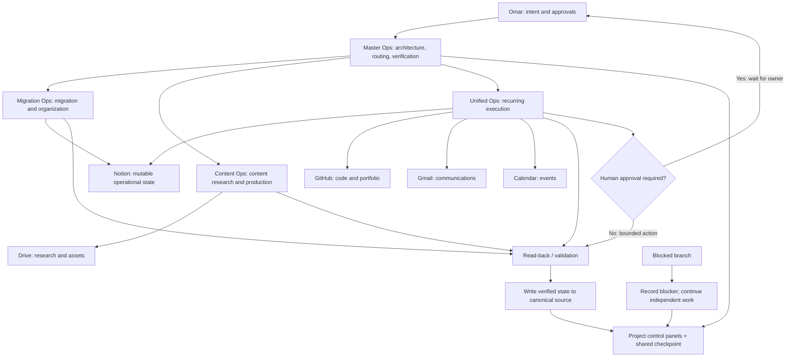

# Architecture

The diagram describes routing and control boundaries. It does not imply a custom runtime or automatic API integration for every depicted service. Product connectors and user-visible workflows perform execution; the checkpoint and canonical systems preserve durable state.

## Control loop

1. Interpret the request and choose its owning Project/workstream.
2. Consult the control panel and current checkpoint.
3. Retrieve the current record from its canonical source.
4. Check for duplicates and verify dependencies.
5. Execute only actions within the approval boundary.
6. Read back the result, write durable state, and record a concise checkpoint.
7. If blocked, record the exact dependency and continue unrelated work.

## Terminology

- **Agentic AI:** a model-driven system that selects steps and tools toward a goal, under defined constraints.
- **Orchestration:** coordinating work, ownership, tool use, state, and control flow across multiple steps or workers.
- **Multi-agent pattern:** a coordinator delegates bounded tasks to specialist agents/operators. Here this is a product-level workflow pattern, not an implemented agent framework.
- **Tool calling / connectors:** the assistant invokes connected services for retrieval or actions. Service access must be tested at the needed permission level.
- **Durable state:** records persisted outside a chat, in a designated system of record.
- **Idempotency / deduplication:** checking identity and current state before a write so repeated runs do not create repeated effects. The live workflow uses operational duplicate checks; it does not expose a custom idempotency-key service.
- **Human-in-the-loop:** a workflow pauses for owner review before consequential actions.
- **Observability and evaluation:** evidence about what a run did and whether it met a testable expectation. The project maintains checkpoints and read-back evidence, but does not yet have centralized tracing or a formal evaluation harness.
- **Failure recovery:** preserve the blocker and resume independently executable branches; retry only when safe and useful.
- **Scheduled execution:** time-triggered operator runs. No event-driven execution engine was implemented.

